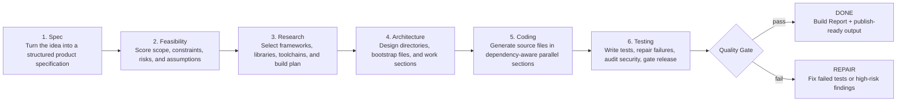

# PhaseLogic

[](https://github.com/jerimie81/PhaseLogic/actions/workflows/test.yml)

**Professional AI software engineering from a plain-English product idea.**

PhaseLogic is a local-first, multi-agent software lifecycle orchestrator. It takes
a user idea, asks the right discovery questions, routes the work to specialized
LLM agents, writes source code, runs quality gates, and produces a Build Report
that explains what was created and how it was validated.

The product premise is simple: serious software should not depend on one chat
window and one model. PhaseLogic uses a structured six-phase SDLC pipeline and
capability-based routing so each agent works where it is strongest.

## Why PhaseLogic

- **Accessible to non-coders:** describe the outcome; PhaseLogic turns it into a
  specification, architecture, source tree, tests, and publishable artifacts.
- **Useful for professionals:** automate scaffolding, plumbing, research,
  dependency setup, tests, and security review while keeping files, logs, and
  decisions inspectable.
- **LLM-agnostic orchestration:** Claude, Gemini, Kimi, Codex/OpenAI, and Ollama
  can be assigned by phase or by saved agent profile.
- **Quality gates:** PhaseLogic can stop in `REPAIR` instead of pretending a
  failed test or high-severity security finding is production-ready.
- **Proof of work:** each run leaves phase artifacts, generated files, test
  reports, security summaries, and a Build Report.

## The Six-Phase Pipeline



| Phase | Default Agent | Primary Output |
| --- | --- | --- |
| 1. Spec | Claude | `phase1_spec.json` with product type, audience, platform, features, and constraints |
| 2. Feasibility | Gemini | `phase2_feasibility.json` with complexity, risk, and buildability assessment |
| 3. Research | Gemini | `phase3_research.json` with stack, libraries, toolchains, and setup plan |
| 4. Architecture | Claude | `phase4_architecture.json` with directory tree, sections, assignments, and bootstrap files |
| 5. Coding | Gemini/Kimi/profile match | Generated project files plus per-section implementation reports |
| 6. Testing | Codex/OpenAI | Tests, repairs, security audit, final quality-gate summary |

Run with `--interactive` to inspect and edit phase artifacts between steps.

## Capability Matching Score

PhaseLogic can route coding sections through saved agent profiles. Each profile
declares role, abilities, tools, knowledge sources, speed/cost preferences, and
workspace permissions. The first routing pass uses a Capability Matching Score
that favors agents whose declared strengths match the section requirements.

KaTeX-compatible formula:

$$
\mathrm{CMS}(a, s) =
\frac{1}{|C_s|}
\sum_{c \in C_s}
\mathrm{match}(a, c)
+
\mathrm{bonus}_{provider}(a, s)
$$

Where:

$$
\mathrm{match}(a, c) =
\begin{cases}
1.0 & \text{if capability } c \text{ exactly matches an ability or role of agent } a \\
0.5 & \text{if capability } c \text{ partially matches an ability or role of agent } a \\
0.0 & \text{otherwise}
\end{cases}
$$

The current implementation is intentionally simple and auditable:

- exact capability matches score `1.0`
- partial string matches score `0.5`
- provider preference adds a small bonus
- no positive score falls back to the explicit section assignment or configured default

This keeps routing transparent while leaving room for future weighting by cost,
latency, historical pass rate, and user trust level.

## Try It

Start with the seeded [Reproducible Demo Template](templates/reproducible-demo/README.md).
It is designed for screenshots, CI smoke checks, onboarding, and repeatable demos.

```bash
git clone https://github.com/jerimie81/PhaseLogic.git
cd PhaseLogic
python3 -m venv .venv
. .venv/bin/activate
python -m pip install -e ".[dev]"
python -m pytest -q

# Dry run: no LLM calls, useful for verifying the local install.
phaselogic new \
  --name fitness-api-demo \
  --dry-run \
  --intake-file templates/reproducible-demo/phase0_intake.json
```

To run the full pipeline instead of a dry run, configure your agent credentials,
make Docker available or set `[sandbox] required = false`, then remove
`--dry-run`.

```bash
phaselogic doctor
phaselogic new \
  --name fitness-api-demo \
  --interactive \
  --intake-file templates/reproducible-demo/phase0_intake.json
```

## Installation

### From Source

```bash
git clone https://github.com/jerimie81/PhaseLogic.git
cd PhaseLogic
pip install -e .
```

### Debian/Ubuntu Package

```bash
./build_deb.sh
sudo dpkg -i phaselogic_0.1.0_all.deb
```

## Requirements

- Python 3.11+
- [Claude Code CLI](https://claude.ai/code) for browser-authenticated Claude runs
- Gemini API key for Gemini phases
- OpenAI API key for Codex/OpenAI testing phases
- Optional Kimi API key for profile/section routing
- Optional [Ollama](https://ollama.com/) for local model support
- Docker when sandboxed Phase 6 execution is required

## Setup

On first run, PhaseLogic checks the configured providers and walks you through
missing keys.

```bash
phaselogic doctor
phaselogic new "a REST API for tracking personal fitness goals"
```

Environment variables are supported:

```bash
export GEMINI_API_KEY=...
export KIMI_API_KEY=...
export OPENAI_API_KEY=...
```

Configuration lives at `~/.config/phaselogic/config.toml`, with a system
fallback at `/etc/phaselogic/config.toml`.

```toml
[claude]
model = "claude-sonnet-4-6"

[gemini]
api_key = ""          # or GEMINI_API_KEY
model = "gemini-2.0-flash"

[kimi]
api_key = ""          # or KIMI_API_KEY
model = "moonshot-v1-32k"
base_url = "https://api.moonshot.ai/v1"

[codex]
api_key = ""          # or OPENAI_API_KEY or ~/.codex/API-key
model = "gpt-4o"

[ollama]
base_url = "http://localhost:11434"
model = "llama3"

[phases]
spec = "claude"
feasibility = "gemini"
research = "gemini"
architecture = "claude"
coding = "gemini"
testing = "codex"

[orchestration]
timeout_seconds = 120
max_retries = 3
retry_backoff_base = 2.0

[sandbox]
enabled = true
required = true
image = "python:3.11-slim"
allow_network = false
memory = "2g"
cpus = "2"
timeout_seconds = 300

[intake]
aggressiveness = 3
```

## CLI Overview

```bash
# Start a new project
phaselogic new "a REST API for tracking personal fitness goals"

# Pause between phases to review artifacts
phaselogic new "a budget tracker app" --interactive

# Control intake depth
phaselogic new "a web scraper" --aggressiveness 1
phaselogic new "a web scraper" --aggressiveness 5

# Reuse a checked-in intake brief for reproducible demos
phaselogic new --intake-file templates/reproducible-demo/phase0_intake.json

# Resume and inspect projects
phaselogic resume my-project-name
phaselogic resume my-project-name --phase CODING
phaselogic list
phaselogic status my-project-name
phaselogic logs my-project-name

# Clean up local workspaces
phaselogic delete my-project-name
phaselogic clean
```

## Agent Profiles

Reusable profiles live in `~/.config/phaselogic/agents/*.toml` and can also be
loaded from a project-local `.phaselogic/agents` directory.

```bash
phaselogic agents create-template backend-builder
phaselogic agents list
phaselogic agents show backend-builder
phaselogic agents validate backend-builder
phaselogic agents test backend-builder
```

Example profile:

```toml
name = "backend-builder"
provider = "gemini"
model = "gemini-2.0-flash"
role = "backend"
personality = "precise, security-minded, and concise"
phase_fit = ["coding"]
abilities = ["api", "database", "validation", "tests"]
tools = ["pytest", "sqlite", "fastapi"]
knowledge_sources = ["docs/backend-style.md"]
workspace_permissions = ["read_only", "generated_write"]
cost_preference = "balanced"
speed_preference = "fast"
safety_constraints = ["ask before network, git, cloud, or deploy actions"]
```

## Integrations and Publishing

Lifecycle connectors are separate from LLM agents.

```bash
phaselogic integrations list
phaselogic integrations status git
phaselogic integrations status github
```

Publish generated output through the GitHub connector:

```bash
phaselogic publish my-project \
  --provider github \
  --repo owner/repo \
  --branch phaselogic/my-project \
  --base main
```

Before pushing, PhaseLogic writes `publish_preflight.json`, scans for
secret-looking values, previews generated files or Git diff state, summarizes
Phase 6 results, and asks for confirmation. Use `--dry-run` to run only the
preflight gate.

## Build Report Example

The strategic goal is zero-config professionalism: every completed project
should leave behind a concise artifact that proves what was built and how it was
checked.

```markdown
# PhaseLogic Build Report: fitness-api-demo

Generated on 2026-05-17 02:40:12

## 1. Project Overview

Description: REST API for tracking workouts, body metrics, and weekly fitness goals.
Primary Language: Python
Frameworks: FastAPI, SQLite, Pytest

## 2. Feasibility & Research

Feasibility Score: 8/10
Build Complexity: moderate

Key Libraries & Toolchains:
- FastAPI: API framework
- Pydantic: request and response validation
- SQLite: local persistence
- Pytest: test runner

## 3. Architecture & Coding

The project was divided into 5 architectural sections.

Generated Artifacts:
- Total Files: 14
- Lines of Code: 1,240
- Workspace Path: ~/.local/share/phaselogic/workspace/fitness-api-demo/generated

## 4. Quality Assurance & Security

Test Results:
- Sections Tested: 5
- Passed: 5
- Failed: 0
- Repaired: 1

Security Audit:
- Critical Issues: 0
- High Severity: 0
- Warnings: 2

Publish Readiness:
- Secret scan: passed
- Quality gate: passed
- Recommended next step: open GitHub pull request
```

The full seeded example lives at
[templates/reproducible-demo/expected-build-report.md](templates/reproducible-demo/expected-build-report.md).

## Project Output

Generated files are written to:

```text
~/.local/share/phaselogic/workspace/<project-name>/generated/
```

Each workspace also contains state, phase artifacts, section reports, security
results, logs, and a Build Report when the project reaches `DONE`.

## Cross-Project Learning

PhaseLogic stores local learning signals in `~/.gemini/memory.db`.
That memory can:

- pre-fill answers based on past choices
- skip redundant low-aggressiveness questions
- show estimated agent call times from observed performance
- index generated files so future runs can reference prior work

## Repository Quality

The repository includes a GitHub Actions workflow that runs the test suite on
Python 3.11 and Python 3.13.

```bash
python -m pytest -q
```

## Strategic Notes

The marketing and positioning seed documents are included in:

- [PL_research.txt](PL_research.txt)
- [AGENT.md](AGENT.md)

They describe the current positioning: multi-agent orchestration, quality gates,
Build Reports, and reproducible template demos as the lead product proof.

## License

MIT
